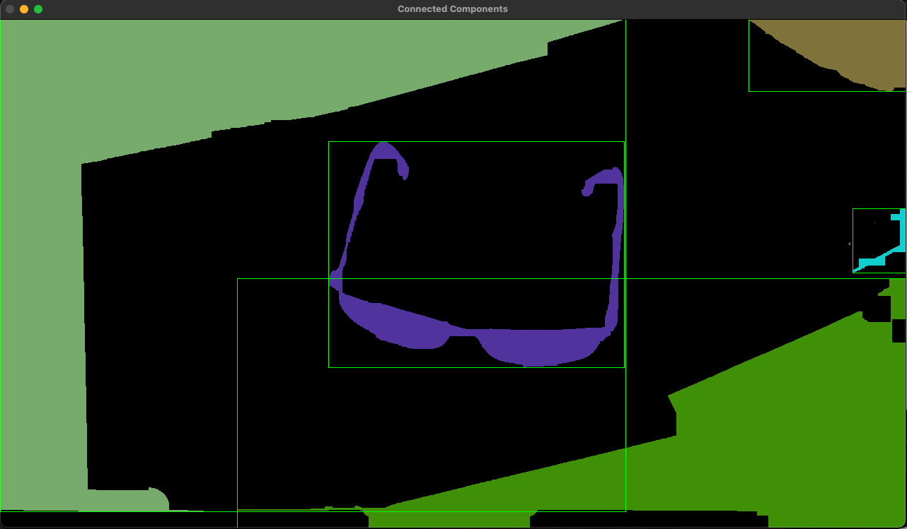
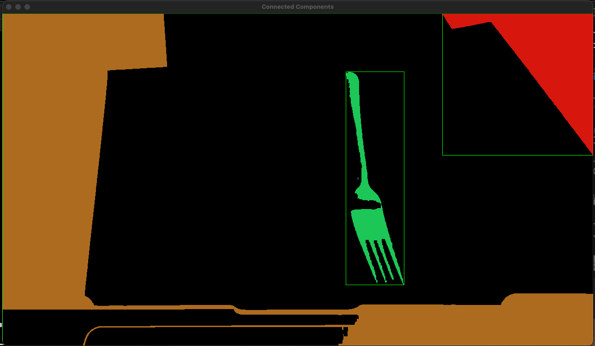
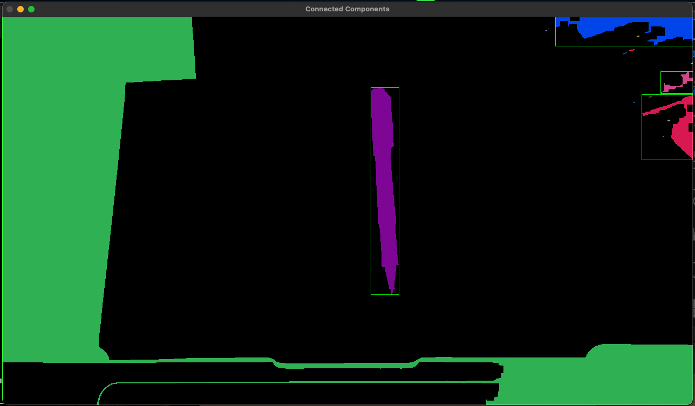
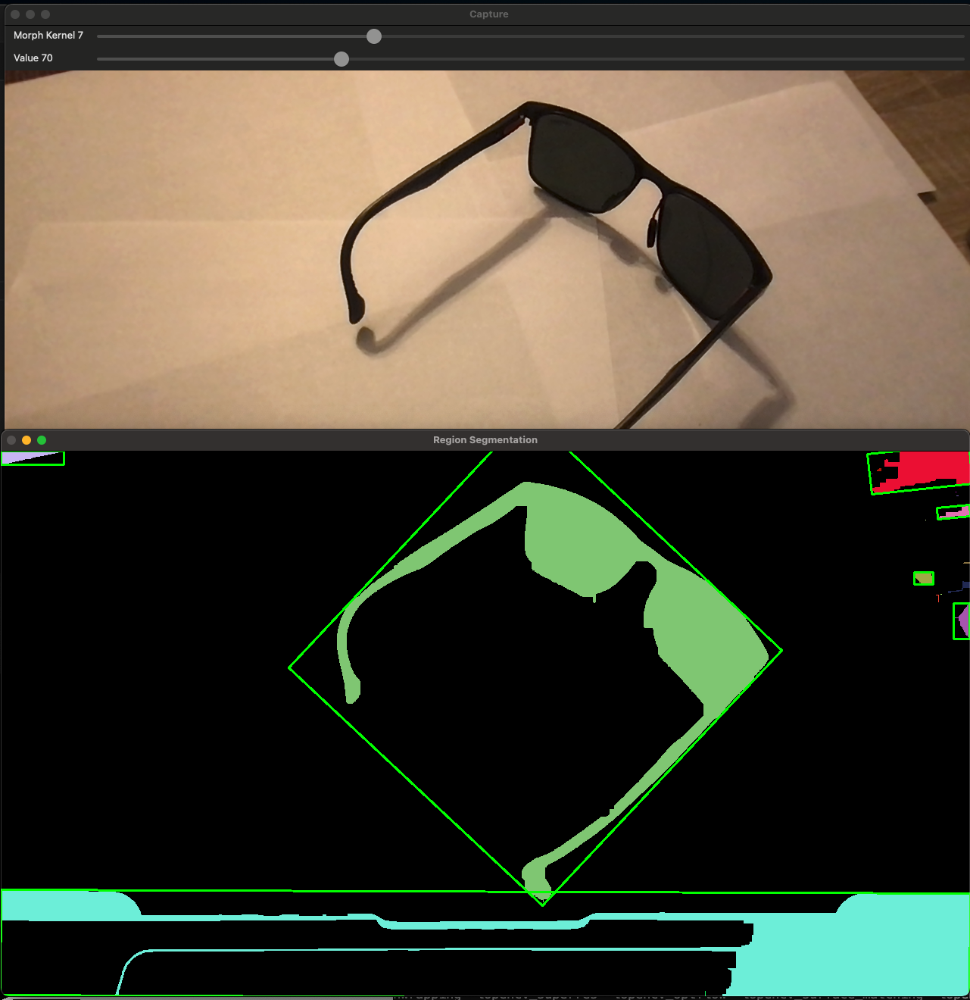
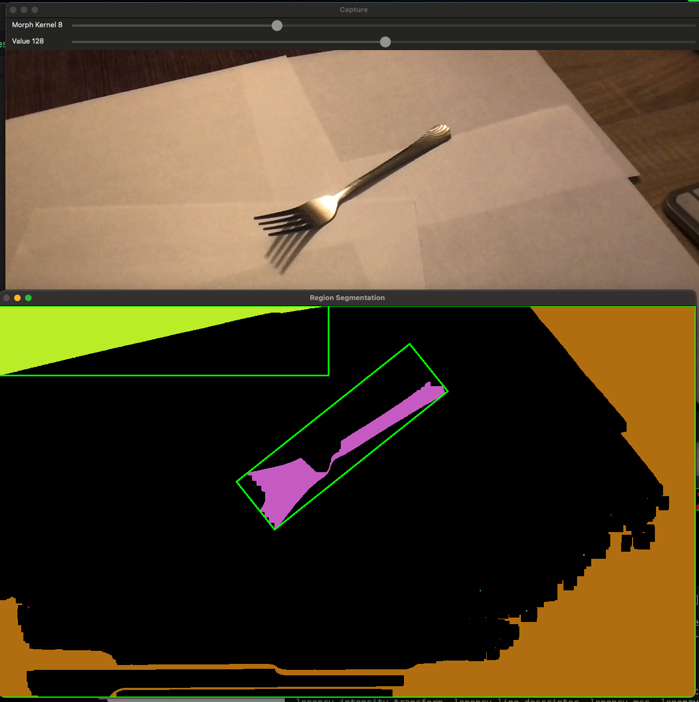
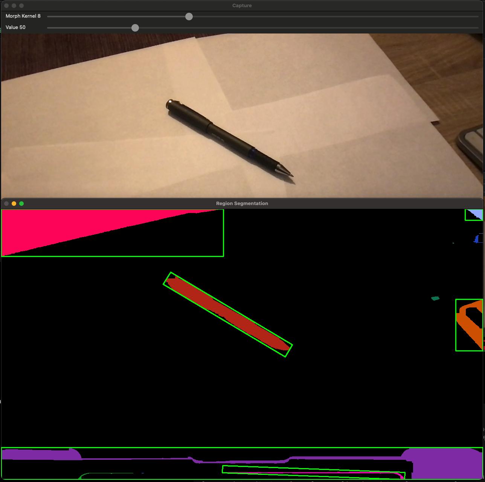
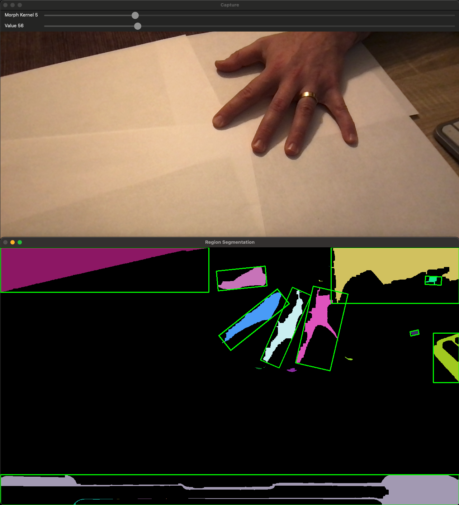

Author: Kevin Heleodoro
Date: February 24, 2024
Purpose: Notes on Project 3 for CS 5530

## Task 1:

Options for thresholding values:

-   Find a value in the valley between two peaks of an image's histogram.
-   Pick a mid-range value of 128
-   Calculate the mean/median pixel value of the image.
-   Otsu's method - minimizes intra-class variance
-   Adaptive thresholding - calculates locally for different regions of the image.

-   https://docs.opencv.org/4.x/d7/d4d/tutorial_py_thresholding.html
-   https://docs.opencv.org/4.x/db/d8e/tutorial_threshold.html
-   https://docs.opencv.org/4.x/da/d97/tutorial_threshold_inRange.html

> Compare the result if applying a gaussian blur to the image. How much of a benefit does it provide?

"Type: \n 0: Binary \n 1: Binary Inverted \n 2: Truncate \n 3: To Zero \n 4: To Zero Inverted";

### Sunglasses

type 1
value 70

### Fork

type 1
value 70

type 1
value 152

### Pen

type 1
value 70

## Task 2:

Clean up the binary image:

-   Use morphological filtering to clean up the images.
    -   noise reduction - morphological opening - white spots
    -   filling holes - morphological closing - black spots

I will use the filling holes approach since the thresholded images seem to be displaying a lot of black spots.
**What are the black spots?**

-   https://towardsdatascience.com/image-processing-class-egbe443-6-morphological-filter-e952c1ec886e
-   https://docs.opencv.org/4.x/db/df6/tutorial_erosion_dilatation.html
-   https://docs.opencv.org/4.x/d3/dbe/tutorial_opening_closing_hats.html
-   https://medium.com/nattadet-c/morphological-filters-d99860d39b85
-

### Sunglasses

> Kernel size of 5 on morph_close did not produce any changes to the black spots present in sunglasses_1
> No changes when using the morph_open with kernel size 5.

> Setting a kernel size of 25 filled in the gaps and overlapped into the shadows.

type 1
value 70
kernel size 25

type 1
value 70
kernel size 15

Differences between 25 and 15 seem negligible. However, dropping down to kernel size 10 allowed for the black spots to show again.

### Fork

value 152
kernel size 15

The fork needs a lot more fine tuning. This is most likely due to the metallic aspects of it. There are many areas of light and dark in the same place.

### Pen

value 70
kernel size 15

## Task 3

Segment into regions

-   Use the built-in `connectedComponentsWithStats` function to determine the regions within the image.

-   https://docs.opencv.org/4.x/d2/dbd/tutorial_distance_transform.html
-   https://docs.opencv.org/3.4/d3/dc0/group__imgproc__shape.html#ga107a78bf7cd25dec05fb4dfc5c9e765f

### Sunglasses

value 70
kernel size 15
min area 250

### Fork

value 126
kernel size 3
min area 250

### Pen

value 91
kernel size 6
min area 250

## Task 4

Compute features for a region

-   Calculate the least central moment and oriented bounding box
-   percent filled
-   bounding box
-   https://docs.opencv.org/4.x/d0/d49/tutorial_moments.html

### Sunglasses

### Fork

### Pen

### Hand

